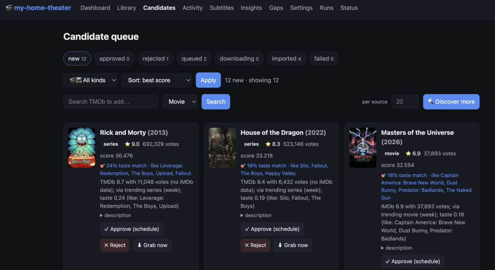

# my-home-theater

Automate a personal movie & TV library end-to-end: scan the NAS, enrich metadata,
discover what's worth adding (rating/vote filtered + learned taste, plus new
seasons of series you own), grab it,
import it, fetch subtitles, and drive the whole thing from an HTML dashboard.
Python-first, SQLite-backed, no Docker required.



## Two ways to run it

The app owns the custom parts (catalog, discovery, taste model, scheduler,
dashboard). How titles are **acquired** and **subtitled** is pluggable:

| Concern | `arr` / `bazarr` (default) | self-contained (native) |
|---|---|---|
| Acquisition | drive Radarr/Sonarr (they own Prowlarr + qBittorrent + import) | search indexers directly → **Transmission** → copy into the NAS layout |
| Subtitles | trigger Bazarr | fetch from **OpenSubtitles** (.com + .org) and **ktuvit** (Hebrew), write `.srt` beside the media |

Select per concern in `config.yaml`: `acquisition.backend: arr|torrent` and
`subtitles.backend: bazarr|native`. The self-contained path needs **no** arr
stack — details in [`docs/torrent-backend.md`](docs/torrent-backend.md) and
[`docs/subtitles-native.md`](docs/subtitles-native.md). Working on the code?
Start with [`docs/SKILLS.md`](docs/SKILLS.md).

## Quick start

```bash
python3 -m venv .venv && .venv/bin/pip install -e ".[dev]"   # or: conda env create -f environment.yaml
cp config.example.yaml config.yaml   # NAS paths, thresholds, backends
cp .env.example .env                 # secrets (see below)
.venv/bin/alembic upgrade head       # create the schema
.venv/bin/home-theater               # serve the dashboard at http://localhost:8000
```

**Secrets (`.env`, never committed).** `DASHBOARD_TOKEN` (gates every mutating
action — `python -c "import secrets; print(secrets.token_urlsafe(32))"`);
`TMDB_API_KEY` + `OMDB_API_KEY`; `SMB_HOST`/`SMB_USER`/`SMB_PASS` for the NAS.
Then per backend: `TRANSMISSION_URL/USER/PASS` (torrent) and/or
`OPENSUBTITLES_*` + `KTUVIT_*` (native subtitles). Optional: `RADARR_*`/`SONARR_*`/
`BAZARR_*`, `TRAKT_*` (watchlist), `TELEGRAM_*` (alerts).

## CLI

```bash
home-theater            # serve the dashboard/API (default)
home-theater scan       # NAS -> owned catalog
home-theater enrich     # backfill TMDb/IMDb ratings/votes/genres
home-theater discover   # find candidates above your thresholds + new seasons of owned series
home-theater acquire    # grab approved candidates (arr or torrent backend)
home-theater sync       # advance in-flight downloads (poll -> import)
home-theater subtitles  # fetch missing subtitles (bazarr or native backend)
home-theater reconcile  # reconcile arr-owned items into the catalog
home-theater backup     # timestamped SQLite backup
```

Everything is also on the dashboard: **Library**, **Candidates** (review/approve),
**Activity** (live grab → download → import → subtitles), **Subtitles**, **Gaps**,
**Insights**, **Settings**, **Status**.

## Going live safely

1. `scan` → `enrich`, open the dashboard, check **Status** shows your services **up**.
2. `discover`, then review/approve on **Candidates**.
3. Keep `features.dry_run: true` until you've watched one clean run; then flip it
   off and grab a legal/public-domain title to validate acquire → sync → import.
4. For unattended operation set `schedule.enabled: true` and install the launchd
   (macOS) / systemd (Linux) unit from [`deploy/`](deploy/).

You're responsible for your sources and their legality; keep review/dry-run modes
on until you trust the pipeline.

## Develop

```bash
.venv/bin/pytest        # 222 tests, no external services hit
.venv/bin/ruff check .
.venv/bin/black .
.venv/bin/mypy src/homeTheater
```

Schema changes: `alembic revision --autogenerate -m "..."` then `alembic upgrade
head` (SQLite batch mode). `init_db()` covers dev/test. Architecture, conventions,
and the hard-won platform gotchas (macOS TCC, SMB mount reliability) are in
[`docs/SKILLS.md`](docs/SKILLS.md); the original design is
[`docs/my-home-theater-plan.md`](docs/my-home-theater-plan.md).
