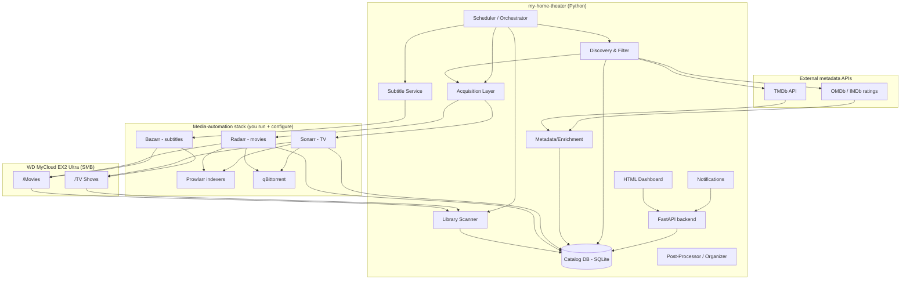

# my-home-theater — Project Execution Plan

A detailed, agent-ready plan to automate a personal movie & TV library: cataloging,
metadata/rating filtering, subtitle fetching, source-agnostic acquisition, NAS
organization, and an HTML dashboard. Python-first. Reuse mature open-source
components wherever possible instead of reinventing them.

---

## 0. Guiding principles

1. **Don't reinvent.** A mature open-source stack already solves acquisition,
   indexing, and subtitle matching. We orchestrate it from Python and build the
   custom catalog + discovery + dashboard on top.
2. **Source-agnostic acquisition.** The app never hardcodes any specific torrent
   site. It talks to a single *indexer aggregator* (Prowlarr) and a *download
   client* (qBittorrent) through clean interfaces. **You** configure which
   indexers/sources to use and are responsible for ensuring your sources and
   usage comply with local law and each site's terms. Prefer legitimate sources
   (media you own, public-domain, Creative Commons, licensed services).
3. **Idempotent & safe.** Every stage is re-runnable. Nothing destructive on the
   NAS without a dry-run mode and a confirmation gate.
4. **Config over code.** Thresholds, paths, credentials, providers all live in
   config, not source.
5. **Observable.** Structured logs, a run history, and a dashboard that shows
   what happened and why.

---

## 1. Two strategic paths (and the recommendation)

**Path A — Orchestrate the existing stack (recommended core).**
Run the proven media-automation apps and drive/aggregate them from Python via
their REST APIs. You get robust acquisition, indexer management, and subtitle
matching "for free," and you spend your effort on the catalog, discovery logic,
and dashboard — the parts that are actually custom to you.

- **Radarr** — movie library automation (search, grab, import, rename).
- **Sonarr** — TV series automation (seasons/episodes, calendars).
- **Prowlarr** — single indexer manager; Radarr/Sonarr and our app query one API,
  you manage sources in one place.
- **qBittorrent** — download client with a documented Web API.
- **Bazarr** — subtitle automation on top of Radarr/Sonarr (multi-provider,
  supports Hebrew).
- **Jellyfin** (or Plex/Emby) — media server + rich UI, optional but gives you
  streaming + metadata + a ready dashboard you can also embed/link.

**Path B — Build every component from scratch in Python.**
Full control, much more work and maintenance (filename parsing, matching,
retries, provider quirks). Only worth it for the parts that are genuinely yours.

**Recommendation: a hybrid.** Use Path A for the "plumbing" (indexers, download
client, subtitle matching) and build in Python:
- your **owned-library catalog** and NAS scanner,
- the **discovery + rating/vote filtering + de-dup** engine,
- the **orchestration/scheduler**, and
- the **custom HTML dashboard** that unifies everything.

The rest of this plan specifies that Python application.

---

## 2. Architecture overview



> **Architectural decision (hybrid, confirmed):** the Python app drives
> **Radarr/Sonarr/Bazarr** via their REST APIs rather than talking to Prowlarr,
> qBittorrent, or OpenSubtitles directly. Radarr/Sonarr own release selection,
> the download client, import, and renaming; Bazarr owns subtitle matching. The
> app's `acquisition`, `subtitles`, and `organizer` modules therefore become
> **thin API clients + status readers**, not reimplementations. This is what
> honors principle #1. **Single source of truth for "what I own": Radarr/Sonarr**
> (they already resolve TMDb/IMDb ids and track files). The SMB scanner is a
> reconciliation/fallback path, not the primary catalog.

**Data flow, plain English:**
1. Scan the NAS → build a catalog of what you already own (keyed by TMDb/IMDb id).
2. Enrich catalog + candidates with metadata (TMDb) and IMDb rating/votes (OMDb).
3. Discovery finds candidates (trending / lists / your watchlist) that pass your
   rating + vote thresholds **and** aren't already owned.
4. Acquisition asks Prowlarr for releases and hands the chosen one to qBittorrent.
5. When a download completes, the organizer renames it, finds subtitles, and
   moves it into the correct NAS folder.
6. The dashboard shows library stats, candidates, in-progress downloads, subtitle
   coverage, and run history.

---

## 3. Technology stack

| Concern | Choice | Notes |
|---|---|---|
| Language/runtime | Python 3.12+ | |
| Web/API | FastAPI + Uvicorn | dashboard backend + JSON API |
| Templating/UI | Jinja2 + HTMX **or** a small React/Vite SPA | start server-rendered, upgrade if needed |
| DB / ORM | SQLite + SQLAlchemy 2.x + Alembic | single-file DB, easy migrations |
| Data validation | Pydantic v2 | config + API schemas |
| HTTP client | httpx (async) | all external APIs |
| Scheduling | APScheduler | periodic scans/discovery |
| Filename parsing | guessit | movie/episode/quality parsing |
| SMB access | smbprotocol / smbclient (Python) | SMB2/3 to the NAS |
| Acquisition/library | Radarr + Sonarr REST APIs (httpx client) | add titles, read owned library, quality profiles |
| Subtitles | Bazarr REST API (read coverage / trigger search) | Bazarr fronts OpenSubtitles/ktuvit |
| Indexers / download | Prowlarr + qBittorrent | configured **inside** Radarr/Sonarr, not called by us |
| Metadata | TMDb (primary), OMDb / IMDb datasets (rating+votes) | see IMDb note below |
| Watchlist source | Trakt API (OAuth) | first-class watchlist; IMDb has no list API |
| Config | YAML + `.env` for secrets | |
| Auth | single shared token/password on FastAPI | destructive endpoints gated |
| Env / deploy | conda (`environment.yaml`) + launchd/systemd | no Docker; OS supervisor keeps it alive |
| Testing | pytest + respx (mock HTTP) | |
| Logging | structlog / loguru | structured, run-scoped |
| Task quality | ruff + mypy + pre-commit | |

> **On IMDb ratings/votes.** IMDb has no free general API. Options, in order of
> preference for a *bulk* backfill:
> 1. **IMDb datasets** (`title.ratings.tsv.gz`, free, refreshed daily) — join on
>    `imdb_id` locally; no per-title rate limit. Best for large libraries.
> 2. **OMDb** (`imdbRating`, `imdbVotes`) — easy per-title, but **free tier is
>    1,000 requests/day**, so backfilling a big library needs multi-day batching
>    + long-TTL cache. Note `imdbVotes` arrives as a string like `"1,234,567"`
>    (and `"N/A"`) — parse and null-handle explicitly.
> 3. **TMDb** (`vote_average`, `vote_count`, `popularity`) — always available;
>    use for discovery lists regardless.

---

## 4. Data model (SQLite)

Core tables (columns abbreviated):

- **title** — `id, tmdb_id, imdb_id, kind(movie|series), title, year, runtime,
  genres, imdb_rating, imdb_votes, tmdb_rating, tmdb_votes, popularity,
  poster_url, overview, updated_at`.
- **owned_file** — `id, title_id, path, kind, season, episode, resolution, codec,
  size_bytes, container, added_at, subtitle_langs(json), hash_optional`.
- **candidate** — `id, title_id, source(discovery|watchlist|manual), status
  (new|approved|queued|downloading|imported|rejected|failed), reason,
  score, created_at, decided_at`.
- **download** — `id, candidate_id, client_hash, magnet_or_release, state,
  progress, save_path, error, created_at, completed_at`.
- **subtitle** — `id, title_id, owned_file_id, lang, provider, path, status,
  fetched_at`.
- **provider_setting** — `id, kind(indexer|subtitle|metadata|download), name,
  config(json), enabled`.
- **scan_run** / **job_run** — `id, kind, started_at, finished_at, status,
  stats(json), log_ref` — powers the dashboard's history & the idempotency checks.
- **setting** — key/value for thresholds & feature flags.

Identity rule: resolve every owned file and candidate to a **TMDb id (and IMDb id
when available)**. De-dup and "do I already own this?" are then a simple id
membership test, not fuzzy string matching. **Prefer ids from Radarr/Sonarr** (the
source of truth) over ids inferred from filenames by the SMB scanner.

Notes:
- Store **genres in a `genre` + `title_genre` join table**, not a comma string —
  the dashboard's genre breakdown and genre filtering need it, and it's a cheap
  table now vs. a migration later. Same for `subtitle_langs`.
- Parse `imdb_votes` from OMDb's `"1,234,567"`/`"N/A"` format on ingest; store as
  a nullable integer.

---

## 5. Module-by-module specification

Each module = its own package with a narrow public interface so the agent can
build and test them independently.

### 5.1 `config`
- Load layered config: defaults → `config.yaml` → env overrides → `.env` secrets.
- Pydantic models for: paths (NAS movie/TV roots), thresholds
  (`min_imdb_rating`, `min_imdb_votes`, `min_tmdb_votes`, allowed resolutions),
  provider credentials, schedule intervals, feature flags (`dry_run`,
  `auto_approve`).
- **Acceptance:** invalid config fails fast with a clear message; secrets never
  logged.

### 5.2 `library_scanner` (NAS via SMB)
- Connect to `smb://MyCloudEX2Ultra…/Elements_25A1-1/Movies` and `.../TV Shows`.
- Walk directories, list media files, parse names with `guessit`, resolve to
  title ids via metadata lookup, upsert `owned_file` + `title`.
- Detect existing subtitle sidecars (`.srt`, `.he.srt`, etc.).
- Read-only first; never writes in this module.
- **Practical note:** `.local` mDNS names can be flaky from containers — support
  configuring the NAS by **IP** as a fallback. Store SMB creds in `.env`.
- **Acceptance:** a full scan produces an accurate owned catalog; re-running is
  idempotent and records a `scan_run`.

### 5.3 `metadata`
- TMDb client: search, details, external ids, trending/lists.
- OMDb client: fetch `imdbRating` + `imdbVotes` by imdb_id.
- Caching layer (respect rate limits; cache details for N days).
- **Acceptance:** given an owned file, the catalog gets correct ids, rating, and
  vote counts.

### 5.4 `discovery` (the "should I get this?" brain)
- Candidate sources (pluggable): TMDb trending/top-rated, a user **watchlist**
  file/table, manual adds via dashboard.
- Filter pipeline: `imdb_rating >= min` **and** `imdb_votes >= min` (your "high
  rank with enough views"), genre/lang preferences, **not already owned**, not
  already a live candidate.
- Score candidates (rating × log(votes) × recency/preference weights) for ranking.
- Output `candidate` rows with `status=new` and a human-readable `reason`.
- Modes: `auto_approve` (queue straight to acquisition) or `review` (wait for a
  click in the dashboard).
- **Acceptance:** given thresholds + an owned catalog, produces a correct,
  de-duplicated, ranked candidate list with explanations.

### 5.5 `subtitles` (Bazarr client)
- Thin **Bazarr** REST client: read per-title subtitle status, list missing
  languages, and **trigger** a search for a title/episode. Bazarr fronts
  OpenSubtitles/ktuvit and does the hash/filename matching + sidecar placement.
- We do **not** fetch or place `.srt` files ourselves — that avoids reinventing
  release matching and NAS writes. Our value-add is *coverage reporting* and a
  one-click "find missing Hebrew subs" that calls Bazarr.
- ktuvit stays a **Bazarr provider** concern (configured in Bazarr), not our code.
- **Acceptance:** the dashboard shows Hebrew-subtitle coverage per title and a
  button that asks Bazarr to search missing ones; state reflects Bazarr's result.

### 5.6 `acquisition` (Radarr/Sonarr client)
- `LibraryAutomation` interface: `add_movie(tmdb_id, quality_profile, root)`,
  `add_series(tvdb_id/tmdb_id, ...)`, `status(id)`, `list_owned()`.
  Primary implementations = **Radarr** (movies) and **Sonarr** (TV) via their
  REST APIs. Radarr/Sonarr then drive **Prowlarr** (release selection, health,
  seeders) and **qBittorrent** (download) — we never call those directly.
- Release selection = a **Radarr/Sonarr quality profile** you configure once;
  the app just picks the profile, monitored flag, and root folder.
- Duplicates / quality upgrades are handled by the profile *cutoff* — no custom
  upgrade logic needed.
- **Acceptance:** an approved candidate results in a monitored movie/series in
  Radarr/Sonarr that grabs + imports (test with a legal/public-domain release),
  and the app tracks its state through Radarr/Sonarr's API.

### 5.7 `organizer` / import reconciliation (thin)
- **Radarr/Sonarr do the rename + import + move into Movies/TV Shows** using
  their own naming config. We do **not** rename or move media on the NAS.
- This module's job shrinks to **reconciliation**: on a Radarr/Sonarr "import
  complete" webhook (or poll), update our catalog, mark the candidate `imported`,
  and record the resulting file. Optionally verify the expected path exists.
- Keep the app's naming convention config in Radarr/Sonarr, not in our code.
- **Acceptance:** after Radarr/Sonarr import a title, our catalog reflects the new
  owned file and the candidate flips to `imported`; re-processing is idempotent.

### 5.8 `dashboard` (FastAPI + UI)
- JSON API over the catalog + runs; server-rendered HTML (Jinja2 + HTMX) to start.
- **Auth (required, even on LAN):** approve/reject buttons trigger real grabs and
  library changes. Gate the app behind a single shared token/password; require it
  on all mutating endpoints. Never echo provider config with secrets back to the UI.
- See §9 for feature ideas.
- **Acceptance:** loads library stats, candidates with approve/reject buttons,
  active downloads, subtitle coverage, and run history; unauthenticated writes are
  rejected.

### 5.9 `scheduler` / orchestrator
- APScheduler jobs: periodic NAS scan, discovery refresh, subtitle sweep,
  download monitor, import/reconcile sweep. Each job writes a `job_run`.
- Global concurrency guard so jobs don't stampede the NAS or APIs. This also
  protects SQLite: **enable WAL mode + a `busy_timeout`** so concurrent job
  writes don't hit `database is locked`.
- Add a **reconciliation job**: catalog vs. NAS filesystem vs. Radarr/Sonarr —
  handle files deleted on the NAS or imports the app didn't originate.
- **Acceptance:** jobs run on their intervals, are individually toggleable, and
  never overlap destructively.

### 5.10 `notifications` (optional)
- Interface with Telegram/email/webhook implementations. Emit on: **new candidates
  above threshold** (our unique event). For import success/failure and grabs,
  prefer reusing **Radarr/Sonarr/Bazarr's built-in Connect notifications** rather
  than re-emitting them.

### 5.11 cross-cutting: logging, errors, rate-limiting, retries
- Structured, run-scoped logs; exponential backoff on all external calls;
  circuit-break a provider after repeated failures and surface it on the dashboard.

---

## 6. Repository structure

```
my-home-theater/
├─ pyproject.toml
├─ environment.yaml              # conda env (preferred install)
├─ deploy/                       # launchd plist + systemd unit (always-on)
├─ .env.example
├─ config.example.yaml
├─ alembic/                      # migrations
├─ src/homeTheater/
│  ├─ config/
│  ├─ db/                        # models, session, repositories
│  ├─ scanner/
│  ├─ metadata/                  # tmdb.py, omdb.py, cache.py
│  ├─ discovery/
│  ├─ subtitles/                 # base.py, opensubtitles.py, ktuvit.py
│  ├─ acquisition/               # base.py, prowlarr.py, qbittorrent.py, policy.py
│  ├─ organizer/
│  ├─ scheduler/
│  ├─ notifications/
│  ├─ api/                       # FastAPI routers
│  ├─ web/                       # templates + static
│  └─ main.py
├─ tests/
└─ docs/
```

---

## 7. Phased delivery plan

Each phase is shippable and has explicit acceptance criteria. Build in order.

- **Phase 0 — Scaffolding.** Repo, pyproject, conda env, ruff/mypy/pre-commit,
  config loader, SQLAlchemy + Alembic baseline, logging. *Done when* `home-theater`
  boots an empty app with a health endpoint. ✅ **Done.**
- **Phase 1 — Catalog & NAS scan (read-only).** SMB connect, walk, parse, upsert
  owned files. *Done when* the DB reflects your real library and re-scans are
  idempotent. ✅ **Code done** (module + tests); pending a real scan once `.env`
  SMB creds are filled in (`home-theater scan`).
- **Phase 2 — Metadata enrichment.** TMDb + OMDb clients + cache; backfill
  ratings/votes/ids. *Done when* owned titles show IMDb rating + votes. ✅ **Code
  done** (clients + TTL cache + `home-theater enrich`); pending a real backfill
  once `TMDB_API_KEY`/`OMDB_API_KEY` are set.
- **Phase 3 — Dashboard v1 (read-only).** Library view, stats, search, subtitle
  coverage. *Done when* you can browse your library in a browser. ✅ **Done** —
  Jinja2 pages (`/`, `/library`, `/runs`) + JSON API (`/api/stats|titles|runs`),
  stats/coverage/genre/decade breakdowns, verified booting.
- **Phase 4 — Discovery & candidates.** Sources + filter/score + de-dup +
  review/auto modes. *Done when* candidates appear with reasons and pass your
  thresholds while excluding owned titles. ✅ **Done** — TMDb trending/top-rated
  sources, threshold filter + rating×log(votes) scoring, dedup vs owned/live,
  `home-theater discover`, candidate queue page + token-gated approve/reject/manual
  API; verified booting.
- **Phase 5 — Subtitle coverage (Bazarr).** Bazarr client: read Hebrew coverage,
  trigger search for missing. *Done when* coverage shows in the dashboard and a
  click asks Bazarr to fill gaps. ✅ **Done** — thin Bazarr client (wanted +
  search-missing), catalog-based coverage + missing list, `/subtitles` page,
  token-gated `POST /api/subtitles/search`, `home-theater subtitles`; verified
  booting. Pending a real Bazarr for the live trigger.
- **Phase 6 — Acquisition (Radarr/Sonarr).** `LibraryAutomation` clients + quality
  profile selection behind the interface. *Done when* an approved candidate becomes
  a monitored title in Radarr/Sonarr that grabs + imports a legal test release.
  ✅ **Code done** — Radarr/Sonarr clients (lookup/add/status/list_owned),
  dry-run-gated `queue_candidate`/`queue_approved` + `sync_downloads`, `POST …/queue`
  endpoint, `home-theater acquire`/`sync`; dry-run verified booting. Pending a real
  Radarr/Sonarr + legal test release for a live grab.
- **Phase 7 — Import reconciliation.** Consume Radarr/Sonarr import webhooks/polls,
  update catalog, flip candidate to `imported`. *Done when* an import is reflected
  in the catalog idempotently (no NAS writes by our app). ✅ **Done** — normalized
  webhook parsing, idempotent `reconcile_import` (upsert title/owned_file by id/path,
  flip candidate + complete downloads), `reconcile_library` poll, token-gated
  `POST /api/webhooks/{radarr,sonarr}` (header or `?token=`), `home-theater
  reconcile`; verified booting.
- **Phase 8 — Scheduling + notifications.** Periodic jobs, concurrency guard,
  alerts. *Done when* the pipeline runs unattended on intervals. ✅ **Done** —
  APScheduler jobs (scan/discovery/subtitle/sync/reconcile, each toggleable by
  interval) with a global lock so they never overlap; Telegram/log notifier for
  new candidates + imports + job failures; started from the `serve` lifespan when
  `schedule.enabled`; verified registering jobs on boot.
- **Phase 9 — Hardening.** Tests to meaningful coverage, retries/backoff,
  error surfacing, docs, backup of the SQLite DB, final launchd/systemd deploy.
  ✅ **Done** — provider health checks + `/status` page + `/api/{providers,status}`
  surfacing reachability & recent failures; SQLite online backup (`home-theater
  backup` + daily scheduler job, prunes to `keep`); real Alembic initial migration
  baseline (autogenerate verified empty on re-run); 77 tests. Retries/backoff exist
  on metadata calls; a provider circuit-breaker remains a future nicety.
- **Phase 10 — Bug-fix sweep + taste/ML features.** ✅ **Done** — full-codebase
  review fixed ~45 verified bugs, the big ones: secret redaction everywhere
  exception text is stored/rendered/notified (`errors.redact_exc`); TMDb
  movie/TV id namespaces de-conflated (`(tmdb_id, kind)` unique, kind-scoped
  lookups in discovery/reconcile); rejected candidates never re-suggested (they
  are training labels); scanner walk-then-write with per-file transaction
  isolation, hidden/system-file filtering, full-path guessit parsing, sidecar
  language validation, deleted-file pruning; enrichment per-title persistence
  with duplicate-title merging and `last_enriched_at` retry stamping; TMDb
  rating fallback when OMDb/IMDb data is missing; date-stamped 1-day trending
  cache; candidate state machine guarded end-to-end (approve/reject/queue/sync,
  `failed` state for vanished downloads, no rejected resurrection); Sonarr
  series-complete semantics, queue pagination, v3 `languageProfileId`;
  `reconcile_library` marks `arr_has_file` (+ Radarr file paths) so arr-owned
  titles leave discovery; multi-episode files recorded; webhook token split
  from the dashboard token; async routes/jobs moved off the event loop;
  scheduler acquire sweep (`acquire_interval_minutes`) makes `auto_approve`
  end-to-end. **Per-kind thresholds**: `thresholds.movie/series` overrides
  (series default to a lower vote bar). **ML groundwork**: feature columns on
  `title` (language, countries, certification, keywords, top cast, directors,
  collection, seasons/episodes/status), `candidate.features` snapshots the
  canonical feature vector (`homeTheater/features.py`) at decision time —
  approve/reject/import decisions become labeled training rows for the
  preference classifier. Migration `a1f3c9d27e54`; 135 tests, ruff+mypy clean.
- **Phase 11 — Taste model + dashboard viz.** ✅ **Done** — `homeTheater/taste.py`:
  TF-IDF over content tokens (genres/keywords/cast/directors/language/decade),
  per-kind KMeans clusters (silhouette-picked k), cosine kNN similarity blended
  into discovery scores + reasons; `/insights` page + `/api/{insights,similarity}`
  + `home-theater insights`; dashboard bar/histogram charts (genres, decades,
  ratings, languages, resolutions). Verified on the real library (218 titles
  scanned over guest SMB, enriched via TMDb+OMDb).
- **Phase 12 — Interactive dashboard.** ✅ **Done** — single-token "unlock" in
  the top bar (localStorage, X-Auth-Token; the pass protecting every mutation).
  Candidates: approve/reject/queue buttons, TMDb search-and-add box
  (`GET /api/candidates/search` + existing manual add), "Discover more" button
  (`POST /api/candidates/discover`, background run with optional per-source
  boost), taste-match line + expandable descriptions. Library: sort by
  added/rating/title/year (default: recently added), Added column, expandable
  descriptions, token-gated catalog-only delete (`DELETE /api/titles/{id}`,
  cascades candidates/downloads/subtitles/files; NAS never touched). Settings
  page: runtime overrides (thresholds global+per-kind, discovery sources,
  taste knobs, auto_approve) stored in the `setting` table, deep-merged over
  config.yaml by `config.runtime.effective_config()` and applied on the next
  discovery run — `dry_run` deliberately file-only. Dashboard: "Recently added"
  poster wall. 151 tests, ruff+mypy clean; all pages + auth verified live.
- **Phase 11 — Taste model + dashboard visualizations.** ✅ **Done** —
  unsupervised content-based taste model (`homeTheater/taste.py`, scikit-learn):
  per-kind TF-IDF over namespaced tokens (genres, keywords, cast, directors,
  language, decade, certification, collection), cosine kNN **similarity** for
  any new title (score + "like: …" neighbors), and silhouette-picked KMeans
  **clustering** that characterizes the library. Discovery blends similarity
  into candidate scores/reasons and snapshots it in `candidate.features.taste`;
  `taste:` config (enabled/min_library/neighbors/weight/max_clusters).
  Surfaces: `/insights` page (cluster cards per kind), `GET /api/insights`,
  `GET /api/similarity?tmdb_id=&kind=`, `home-theater insights` CLI.
  Dashboard v2: genre/resolution/language bar charts, decade + IMDb-rating
  histograms with direct labels, avg-rating stat, coverage meter — single-hue
  viz token contrast-checked for light and dark. 142 tests, ruff+mypy clean.

---

## 8. Configuration & secrets

`config.yaml` (non-secret): NAS paths, thresholds
(`min_imdb_rating: 7.0`, `min_imdb_votes: 25000`, allowed resolutions),
quality profile, schedule intervals, feature flags (`dry_run: true`,
`auto_approve: false`), enabled providers.

`.env` (secrets): `TMDB_API_KEY`, `OMDB_API_KEY`, `OPENSUBTITLES_API_KEY`,
`SMB_USER`, `SMB_PASS`, `SMB_HOST` (IP fallback for `.local`),
`QBITTORRENT_URL/USER/PASS`, `PROWLARR_URL/API_KEY`, optional `KTUVIT_*`,
`TELEGRAM_*`. Never commit `.env`; ship `.env.example`.

---

## 9. Dashboard feature ideas ("cool stuff")

- **Library at a glance:** counts, total size, resolution/codec breakdown,
  genres, decade histogram, storage used vs. free on the NAS.
- **Subtitle coverage:** % of titles with Hebrew subs; one-click "find missing."
- **Candidate queue:** ranked recommendations with poster, IMDb rating + votes,
  the *reason* it was suggested, and approve/reject buttons.
- **Live downloads:** progress, ETA, seeders, save path.
- **Recently added** wall with posters.
- **"Why not owned yet?"** — top-rated titles you don't have, above threshold.
- **Run history / health:** last scan, last discovery, provider status, errors.
- **Duplicates / quality upgrades:** same title in lower resolution flagged.
- **Watchlist import:** paste IMDb/TMDb list → candidates.
- **Personal insights:** most-common genres, average rating of your library vs.
  the candidates you skip.

---

## 10. Testing strategy

- Unit-test parsing (guessit edge cases), filtering/scoring, naming/organizer
  logic (pure functions, no I/O).
- Mock all external APIs with `respx`; never hit real services in CI.
- Contract tests per provider interface so implementations are swappable.
- Organizer + scanner tested against a temp filesystem; SMB behind an interface
  so it can be faked.
- Always exercise **dry-run** paths.

---

## 11. Deployment

- **Conda-first (no Docker).** Run the app inside the `environment.yaml` conda env.
- Keep it always-on via the OS supervisor, not a container:
  - macOS → a `launchd` agent (`deploy/com.homeTheater.app.plist`).
  - Linux mini-PC/NAS → a `systemd` unit (`deploy/home-theater.service`).
- Radarr/Sonarr/Bazarr/Prowlarr/qBittorrent are set up separately as their own
  long-lived services; the app just talks to their APIs.
- Persist `data/` (SQLite DB + logs) and `config.yaml`; schedule a periodic DB
  backup. Health/readiness endpoints back the supervisor's restart policy.

---

## 12. Risks & considerations

- **Content sourcing / legality.** Acquisition is deliberately source-agnostic.
  You configure indexers and are responsible for ensuring your sources and use
  comply with local law and each provider's terms. Prefer legitimate sources
  (media you own, public-domain, Creative Commons, licensed services). Keep
  `dry_run`/review modes on until you trust the pipeline.
- **`.local`/mDNS resolution** from containers can fail → support NAS-by-IP.
- **SMB reliability** on consumer NAS: retries, verify-after-move, don't delete
  source until the move is confirmed.
- **API rate limits** (TMDb/OMDb/OpenSubtitles): cache aggressively, backoff.
- **Subtitle sync**: match by release/hash, not just title, to avoid drift.
- **ktuvit specifics**: session/login required and terms may restrict automation;
  keep it optional and degrade gracefully.
- **Site/API drift**: isolate every external dependency behind an interface so a
  breaking change touches one file.

---

## 13. Concrete first steps for the agent

1. Scaffold the repo per §6 (Phase 0): pyproject, conda env, tooling, config loader,
   DB baseline, logging, health endpoint.
2. Implement `library_scanner` read-only against the two NAS paths (support IP
   fallback) and prove an idempotent scan of the real library.
3. Add `metadata` (TMDb + OMDb) and enrich the catalog with ratings + votes.
4. Ship dashboard v1 (read-only) so progress is visible.
5. Proceed phase by phase; keep `dry_run: true` until Phases 6–7 are validated
   with a legal test release.

---

## Appendix — Instructions to the AI agent

- Treat each module in §5 as an independent unit with the stated interface and
  acceptance criteria; build and test it before moving on.
- Do **not** hardcode or scrape any specific torrent/piracy site. Implement the
  `IndexerProvider` against **Prowlarr** and the `DownloadClient` against
  **qBittorrent**; the human operator configures actual sources.
- Everything external goes behind an interface with a mocked test.
- Default to non-destructive: dry-run + confirmation before any NAS write or
  download grab.
- Prefer reusing the established tools (Radarr/Sonarr/Bazarr/Prowlarr/
  qBittorrent, TMDb/OMDb/OpenSubtitles) over custom implementations.
- Ask the operator for any missing credentials/thresholds rather than guessing.
